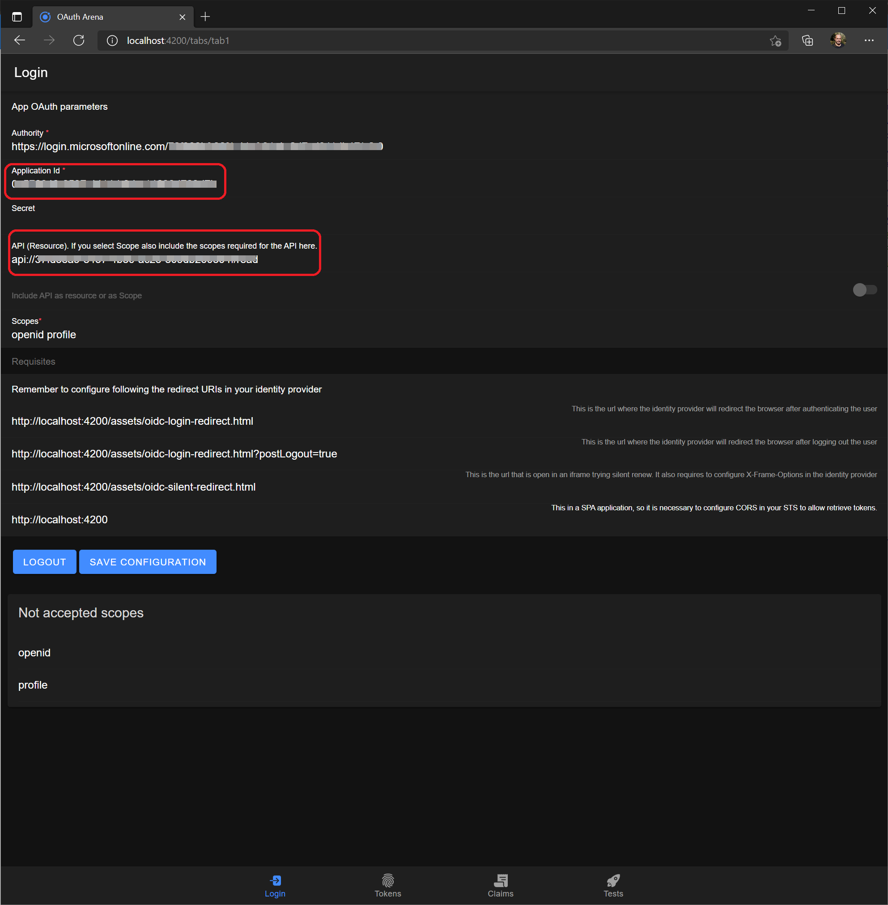
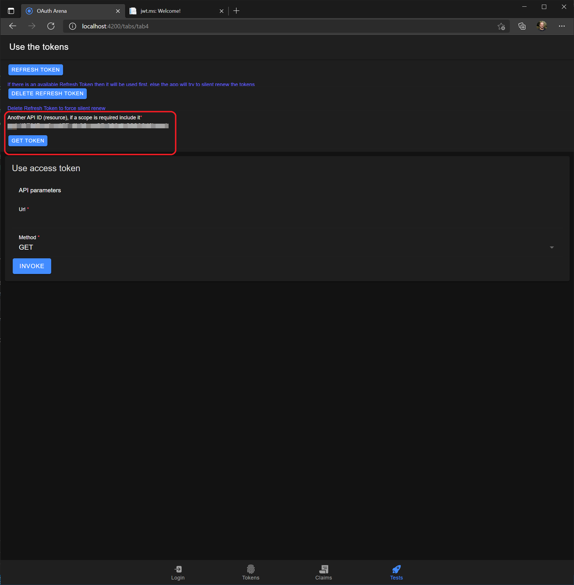

# OAuth Arena
Single Page Application to test any OpenId Providers and validate results.
This SPA uses [oidc-client.js library](https://github.com/IdentityModel/oidc-client-js) to manage the authentication.
There is a demo site where you can test it:
https://identityspa.z6.web.core.windows.net

## How to start
This app allows you to authenticate against almost any Identity Provider (IdP) using Authorization Code Grant flow. This application can be used as a Web Application or a Mobile Application. This application uses [Ionic framework](https://ionicframework.com/) and it is possible to create an iOS or Android application. In this sample it is included the Android implementation.

* If you provide a secret (which is totally not recommended for SPA) the app will try to use code grant as a confidential application.
* If you don't provide a secret (recommended for SPA application) the app will use Code Grant + Proof Key for Code Exchange (PKCE).

Once you have an application registered in your Identity Provider you can test it. 
Below a sample using Azure Active Directory (AAD), see [Tutorial: Register a single-page application (SPA) in Azure Active Directory B2C](https://docs.microsoft.com/en-us/azure/active-directory-b2c/tutorial-register-spa).

The authority parameter is the root url of your identity provider. For instance for AAD you can take it from the endpoints button.

It is:
https://login.microsoftonline.com/yourtenant/v2.0/
The app retrieves the rest of configuration from OpenId Connect metadata document
https://login.microsoftonline.com/yourtenant/v2.0/.well-known/openid-configuration.

The Application Id can be retrieved from the Application Registration overview page.


Install all dependencies
```bash
npm install
```
or
```bash
yarn install
```
Then you can start playing locally.
```bash
npm start
```
or
```bash
yarn start
```


## Important
As you can see when you start the app, you need to configure your Application Registration to properly work with this SPA application.
### Redirect Uri
You need to configure the redirect url after the user is authenticated. If you are running this on your local machine usually is something like this
```
http://localhost:4200/assets/oidc-login-redirect.html
```
But if you deploy this application in the internet it will be something like:
```
https://youraddress/assets/oidc-login-redirect.html
```
If the app is deployed as a mobile application it will require to configure the registered application deeplink. This is configured in [environment.ts](./src/environments/environment.ts) file in spaSchema parameter:
```typescript
export const environment = {
  production: false,
  otherApp: '',
  spaSchema: 'https://identityspa.z6.web.core.windows.net'
};
```

This application uses the login redirect page also for logout, just adding a parameter. In AAD it is not required adding a new address, but maybe other Identity providers may require it.

If you want to test silent renew it is also needed to configure the silent redirect page.
```
http://localhost:4200/assets/oidc-silent-redirect.html
```
This feature was usefull with implicit flow as there is no refresh token, but not that usefull with code grant. This feature tries to perform an automatic login using the Single Sign-On cookie of the Identity Provider by opening the authentication page in a hidden Frame. This behavior is not recommended, indeed modern browsers do not recommend it and will disable this possibility at some point in the future. If you want to use it anyway it is required to configure X-Frame-Options in your identity provider. Azure AD doesn't support this configuration. [ADFS supports it](https://docs.microsoft.com/en-us/windows-server/identity/ad-fs/operations/customize-http-security-headers-ad-fs#x-frame-options).

## How to use the application
As mentioned above, you can configure your app and start the login process. The application will configure OpenId Connect client using the Metadata Document, then will open the autority endpoint passing the parameters.
If authentication succeeds the Identity Provider will redirect the app to the redirect_uri, where the app will take the authorization code and redeem it to get the tokens (id_token, access token and refresh token).

If there is a scope that is not authorized by the Identy Provider it will be shown in the home tab.

Typically the applications requests permissions, but the user may not consent. In that case the scope won't be returned, so the application must check it if they need it.

To logout just click the Logout button.
### See tokens
You can see the tokens content in the tokens tab. The buttons below each token open jwt.ms with the corresponding token. 

jwt.ms allows to explore the tokens and include a description for common claims.

### See JWT tokens content
The tab Claims show the decoded content of the tokens

The content of this page can be visualized better in jwt.ms
### Test scenarios
The test tab allows to perform some common scenarios.
#### Refresh token
oidc-client library automatically refresh the tokens before it expires. You can force token refreshing by clicking _Refresh Token_ button.

If there is no refresh token available the library tries to perform a silent renew (open a hidden frame and try to authenticate without parameters). If you want to force using silent renew you can click _Delete refresh token_ button and then _Refresh token_.

#### Retrieve tokens for different APIs
When an application needs to consume an API usually requests an access token during sign-in. 
It can be requested as a regular scope or in a specific parameter (resource in ADFS).

The result is an access token with the desired audience (aud claim).

But what if you need to invoke another API with different audience? It can be done using the refresh token. The application allows to get an access token for a different audience:

#### Invoke an API.
You can use the access token to invoke a target API.

### Save/Use configurations
This application allows to save configurations for later use. Just click _Save Configuration_ button in the home tab.
When you are not logged in it shows a list of saved configurations. By sliding to the left it shows the options for the configuration. You can use it, then it loads the parameters, or you can delete it.

